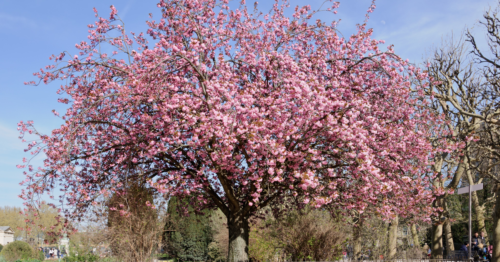

By Ian Bell • Twitter: [Ian_Bellio](https://twitter.com/Ian_Bellio) • January 2020

The top five most common genera of tree in the city limits of San Franciso, according to the City of San Francisco tree census [^1]. Place your mouse over trees on the maps below to explore individual species in each genera, tree locations, sizes (expressed as inches in diameter at breast height(dbh)), and dates planted. 

```{r setup, include=FALSE, warning = FALSE}
library(tidyverse)
library(rgdal)
library(lubridate)
library(osmdata)
library(sf)
library(ggmap)
library(prettydoc)
library(plotly)

sf_trees <- readr::read_csv('https://raw.githubusercontent.com/rfordatascience/tidytuesday/master/data/2020/2020-01-28/sf_trees.csv')

top_genus <- sf_trees %>%
  mutate(Genus = word(species, 1)) %>%
  filter(Genus != "Tree(s)") %>%
  count(Genus) %>%
  arrange(desc(n)) %>%
  top_n(5,n) 

Prunus <- sf_trees %>%
  mutate(Genus = word(species, 1)) %>%
  filter(Genus == "Prunus" )

Platanus <- sf_trees %>%
  mutate(Genus = word(species, 1)) %>%
  filter( Genus == "Platanus")

Ficus <- sf_trees %>%
  mutate(Genus = word(species, 1)) %>%
  filter( Genus == "Ficus")

Pittosporum <- sf_trees %>%
  mutate(Genus = word(species, 1)) %>%
  filter( Genus == "Pittosporum")

Tristaniopsis <- sf_trees %>%
  mutate(Genus = word(species, 1)) %>%
  filter( Genus == "Tristaniopsis")

```
## 1. Fruit Trees (*Prunus*)

 

The most common type of tree in San Francisco are fruit trees of the genus *Prunus*. According to the data, there are `r count(Prunus)` trees of this genus in the city limits. The oldest tree of this type on record in the database was planted in `r format(min(Prunus$date, na.rm=TRUE), '%B %Y')` and is `r sprintf ("%.1f", as.double(Sys.Date() - min(Prunus$date, na.rm=TRUE))/365)` years old. Trees of this type are dense in the areas of the city around Twin Peaks, such as Noe Valley, the Castro, and Forest Hill.

```{r prunus, echo=FALSE, warning=FALSE, cache=TRUE, dpi=300, message=FALSE, fig.align="center", fig.cap="Fruit Trees in SF"}
sf_map <- get_map(location = c(left = -122.5601, bottom = 37.6993, right = -122.3167, top = 37.8116), zoom = 14 , color = "color")

sf_plot <- ggmap(sf_map) +
  geom_point(data = Prunus, aes(x =longitude, y =latitude,label = species, label1=address, label2 = dbh, label3 = date), size=1.1, alpha = 0.45, shape = 1, color = "red") +
  theme(axis.title=element_blank(),axis.text=element_blank(),axis.ticks=element_blank())


ggplotly(sf_plot, height = 450, width=900, tooltip = c("species","address", "dbh", "date"))


```
## 2. *Platanus* 


Some of the most common species of the *Platanus* genus include the London plane and American sycamore. According to the data, there are `r count(Platanus)` trees of this genus in the city limits. The oldest tree of this type on record in the database was planted in `r format(min(Platanus$date, na.rm=TRUE), '%B %Y')` and is `r sprintf ("%.1f", as.double(Sys.Date() - min(Platanus$date, na.rm=TRUE))/365)` years old. These trees line some of the major streets in the City of San Francisco, such as Market Street, California Street, and Van Ness Ave. 

```{r Platanus, echo=FALSE, warning=FALSE, cache=TRUE, dpi=300, message=FALSE, fig.align="center", fig.cap="Platanus Trees in SF"}
sf_map <- get_map(location = c(left = -122.5601, bottom = 37.6993, right = -122.3167, top = 37.8116), zoom = 14 , color = "color")

sf_plot <- ggmap(sf_map) +
  geom_point(data = Platanus, aes(x =longitude, y =latitude,label = species, label1=address, label2 = dbh, label3 = date), size=1.1, alpha = 0.45, shape = 1, color = "purple") +
  theme(axis.title=element_blank(),axis.text=element_blank(),axis.ticks=element_blank())


ggplotly(sf_plot, height = 450, width=900, tooltip = c("species","address", "dbh", "date"))


```

This is fun product for #TidyTuesday, a weekly social data project focused on using R programing languare tidyverse packages to clean, wrangle, tidy, and plot a new dataset every Tuesday. The data is what it is, and this project was more focused on code practice than tree science. Thanks to Yan Holtz and his [Pimp my RMD: a few tips for R markdown](https://holtzy.github.io/Pimp-my-rmd/) for helpful tips.

[^1]: DataSF Street Tree List <https://data.sfgov.org/City-Infrastructure/Street-Tree-List/tkzw-k3nq>
